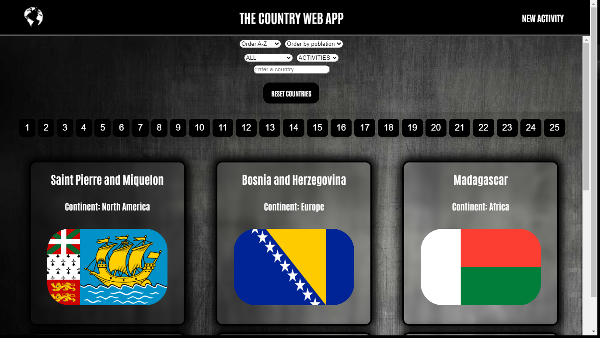
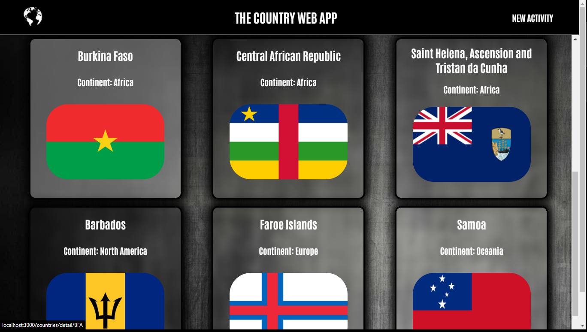
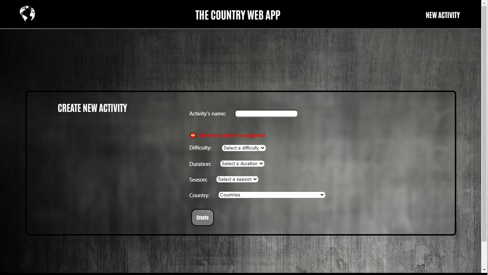
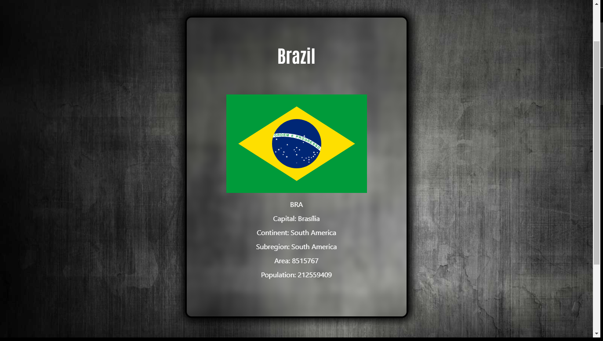
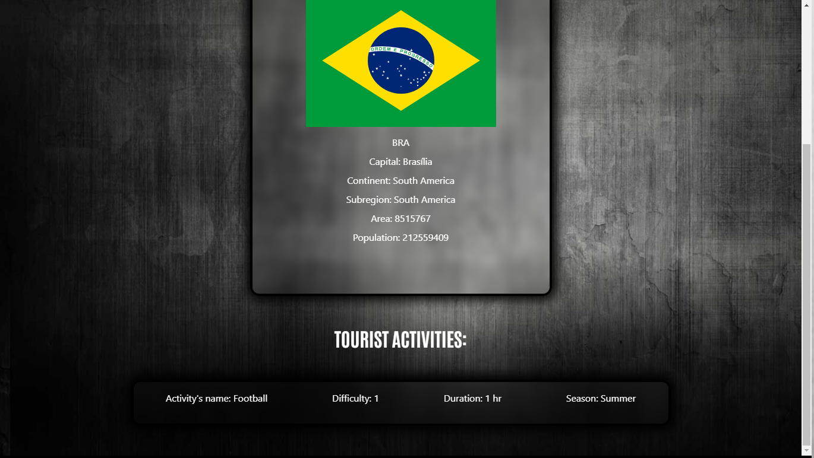

## Project's goals
In this individual project at Henry I had the opportunity to apply everything I learned in these 5 months. It should be noted that in it we were not allowed to use libraries, everything had to be "pure". The idea was to create a SPA (Single Page Application) that shows me relevant information from approximately 250 countries. I got them from an API that Henry provided me. Likewise, this information was stored in a database, and from there it was manipulated, to show it or add tourist activities to each country.

## Learnings
I remember that when I started the project all my knowledge was "up in the air", so I was able to finish settling it, uniting everything I had learned.
I was able to reaffirm the knowledge, for example, Promises, Async/Await, React, Redux. As well as the same logic to be applied to show the tangible, which in this case would be the Activities by countries and the Countries themselves.

## Conclusion
Actually at this stage I was able to apply most of the technologies I learned.
Which is why I had a lot of fun doing it, and most of all, I enjoyed it!
It was just the beginning of what was to come!

## Algunas imagenes

<h3>Home.</h3>

The main view contains a Navigation Bar, it has a search bar to search for countries by their names.
Further down we can see a series of filters and tools that will allow us to order the countries by name or population. There are also pagination buttons, they will allow us to navigate between the pages and between the more than 200 countries. 

 

 

 <h3>All countries</h3>

 
This section is where we can see a list of 10 countries on the first page, and 9 for the rest of the pages. (Condition that Henry required to approve the project)

 

 

 <h3>New Activity</h3>
 
 Here we can create an activity for the countries we want. being able to choose
 its difficulty, duration, practice season and the countries to which we want to assign said activity.

 

 

 <h3>Country Detail</h3>
 
The detail of the country will be the module of the app in charge of showing me data of the selected country, such as its population density, its capital, among others.

 

 

 <h3>View of activity in country</h3>
 
Below the detail of the country we will be able to visualize the activities linked to the country in question, if it has them.

 
